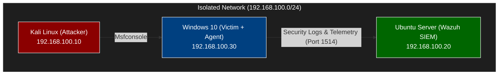

# :shield: Home Lab: Wazuh , Windows 10 Endpoint & Kali Linux
Disclaimer: This content is strictly for educational and defensive security awareness purposes. All demonstrations were conducted in an isolated, authorized lab environment owned by the creator. Unsanctioned or malicious testing against systems without prior permission is illegal.
---
SOC home lab built in QEMU/KVM. This environment simulates active attacker from Kali Linux against a monitored Windows 10 target, streaming security telemetry into a containerized Wazuh server.

---


## :straight_ruler: Network Architecture

The lab operates on an isolated network with zero outbound internet forwarding to ensure the attack simulation.



### Virtual Machine Inventory : 

| Node            | Operating System      | IP Address       | Role / Services                            |
| :-------------- | :-------------------- | :--------------- | :----------------------------------------- |
| **Attacker**    | Kali Linux            | `192.168.100.10` | Red Team execution, Nmap, Hydra            |
| **SIEM/EDR Server** | Ubuntu Server 24.04   | `192.168.100.20` | Wazuh Manager, Indexer, Dashboard          |
| **Endpoint**    | Windows 10 Enterprise | `192.168.100.30` | Target endpoint running Wazuh Agent        |

---

## :rocket: Deployment Guide

### Step 1: Network Configuration (QEMU/libvirt)
I setup the isolated network via the graphical interface of the QEMU.


#### Step 2.1 Network configuration of VM's

I set up every VM with an static IP. For Ubuntu (Wazuh server) I set up in /etc/netplan/01-network-manager-all.yaml, for Kali I used the GUI interface and for Windows I config from Powershell terminal.


In Windows I Enabled the "Remote Desktop" and "File and Printer Sharing"


### Step 3: Deploy Wazuh Server (Ubuntu 26.04 VM)

1. I updated the Ubuntu after installing the Wazuh server and installed curl
   ```bash
   sudo apt full-upgrade
   sudo apt install curl
   ```

2. For installing Wazuh server I used :
   ```bash
   curl -sO https://packages.wazuh.com/4.14/wazuh-install.sh && sudo bash ./wazuh-install.sh -a
   ```
   I used the default configuration.

---

### Step 3: Install Wazuh Agent (Windows 10 VM)

Open **PowerShell as Administrator** on Windows 10 (`192.168.100.30`) and execute:

```powershell
# Install agent and link to Wazuh Manager IP
Invoke-WebRequest -Uri "https://packages.wazuh.com/4.x/windows/wazuh-agent-4.9.2-1.msi" -OutFile "wazuh-agent.msi"; `
Start-Process msiexec.exe -ArgumentList '/i wazuh-agent.msi /q WAZUH_MANAGER="10.0.0.2"' -Wait

# Start agent service
NET START Wazuh
```

---

## 🎯 Attack Simulation & Validation

### Searching for open ports using Nmap

```bash
   sudo nmap -A -p- -T4 -vv 192.168.100.30
   # Static IP from Windows 10
```
   Parameters Breakdown:
```
      -A: Enables Agressive scanning
      -p-: Scans all 65,535 TCP ports
      -T4: Sets the timing template to Agressive
      -vv: Increase verbosity level
```


It found the 445 port open (Enabled previos on Windows 11. The "File and Printer Sharing")

The port 445 is used by Modern Server Message Block (SMB). SMB is a network communication protocol used primarily in Windows env for sharing access to files, printers, serial ports and miscellaneous comunications between node on a network.

### Attacking and Validating

I used metasploit Framework with SMB authentification test to see the alert on Wazuh Dashboard.

```bash
   msfconsole -q -x "use auxiliary/scanner/smb/smb_login; set RHOSTS 192.168.100.30; set SMBUser TestUser; set SMBPass WrongPassword; run; exit"
```
   Command Breakdown:
```
       msfconsole: Launches the Metasploit Framework command-line interface.

    -q (Quiet): Suppresses the Metasploit banner graphics.

    -x: Tells Metasploit to execute a string of commands sequentially (separated by semicolons ;) and immediately run them.
```

   Execution Steps:

```
    use auxiliary/scanner/smb/smb_login

    Loads the Metasploit scanner module designed to test login credentials against Server Message Block (SMB) services operating on TCP port 445.

    set RHOSTS 192.168.100.30

    Defines the target host IP address as 192.168.100.30 (Windows 10 Test VM).

    set SMBUser TestUser

    Sets the username variable to TestUser.

    set SMBPass WrongPassword

    Sets the password variable to WrongPassword.

    run

    Executes the scan, sending the authentication request to the target host.

    exit

    Terminates msfconsole as soon as the module finishes running.
```


In Wazuh Dashboard was captured the incoming log

Triggered Rule: Rule 60122

Description: Logon Failure - Unknown user or bad password

Alert Level: Level 5 (Medium severity alert)

Log Analysis:

   Multiple logon failures appear in the Threat Hunting dashboard corresponding to the exact timestamps of the Metasploit SMB login execution. This confirms that the Wazuh agent successfully detected the unauthorized SMB authentication attempt and transmitted the telemetry to the central SIEM server for event correlation.

